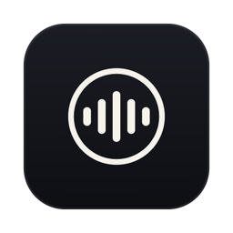
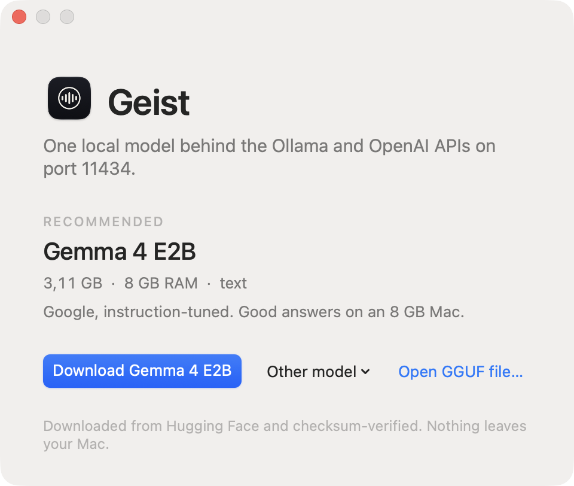

# Geist for macOS



A menu bar app that runs [geist-serve](https://github.com/geisten/geist-serve):
one local model behind the Ollama and OpenAI APIs on `localhost:11434`, for
VS Code, Continue, Cline, Zed, Cursor, Open WebUI and the `ollama` CLI.
Like Ollama.app, without Ollama.

Status: the app runs the server, downloads and verifies models, registers
as a login item, installs the command line tool and checks for updates.
Signed releases and the Homebrew cask wait for the Developer ID
([v0.1 milestone](https://github.com/geisten/geist-serve-mac/milestones)).
The icon is rendered by `scripts/icon.swift`; the welcome window can be
photographed with `GEIST_SNAPSHOT_WELCOME=out.png`.



```sh
make        # fetches the pinned geist-serve release binary (SHA-verified),
            # swift build, assembles build/Geist.app (ad-hoc signed)
make run
make test   # bundle sanity
```

Apple Silicon, macOS 14+. The app is Swift; the server it bundles is the
unmodified geist-serve release binary, pinned in `scripts/fetch-server.sh`.
Signing and notarization happen in the release workflow once the
Developer ID is in place; local builds are ad-hoc signed.

## Design (from the 2026-09-24 interview)

- Login item via SMAppService; geist-serve runs as a child process; quitting
  the app stops the server; changing the model restarts it.
- Curated model list from geistlib's MODELS.md with SHA pins, downloads to
  `~/Library/Application Support/Geist/models`, plus "Add GGUF file…".
  Gemma 4 E2B offered on first launch. Text only in v1.
- Menu: status, model, start at login, reachable on the network, show log,
  install command line tool (`geist-serve` symlink), check for updates, quit.
  Port fixed at 11434; a running Ollama is detected and can be stopped.
- Sparkle 2 updates from an appcast on GitHub releases; DMG per `v*` tag;
  Homebrew cask `geist` in geisten/homebrew-tap.

Apache-2.0.
